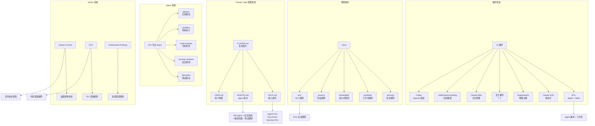
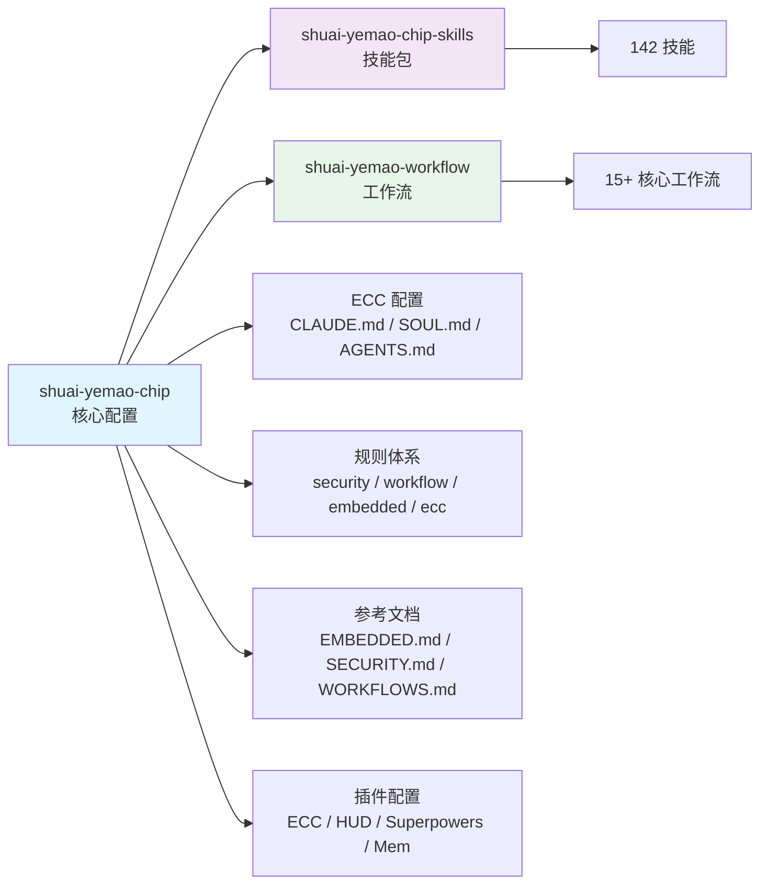
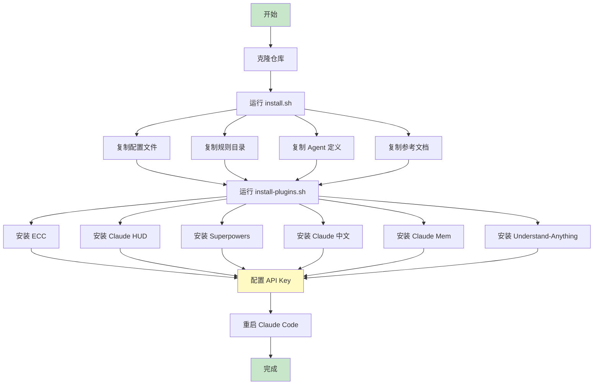
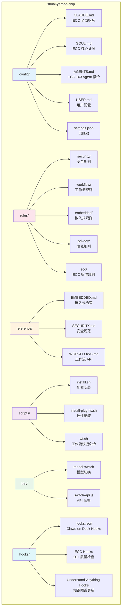
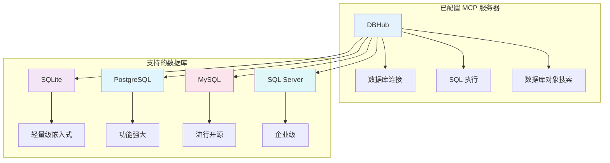
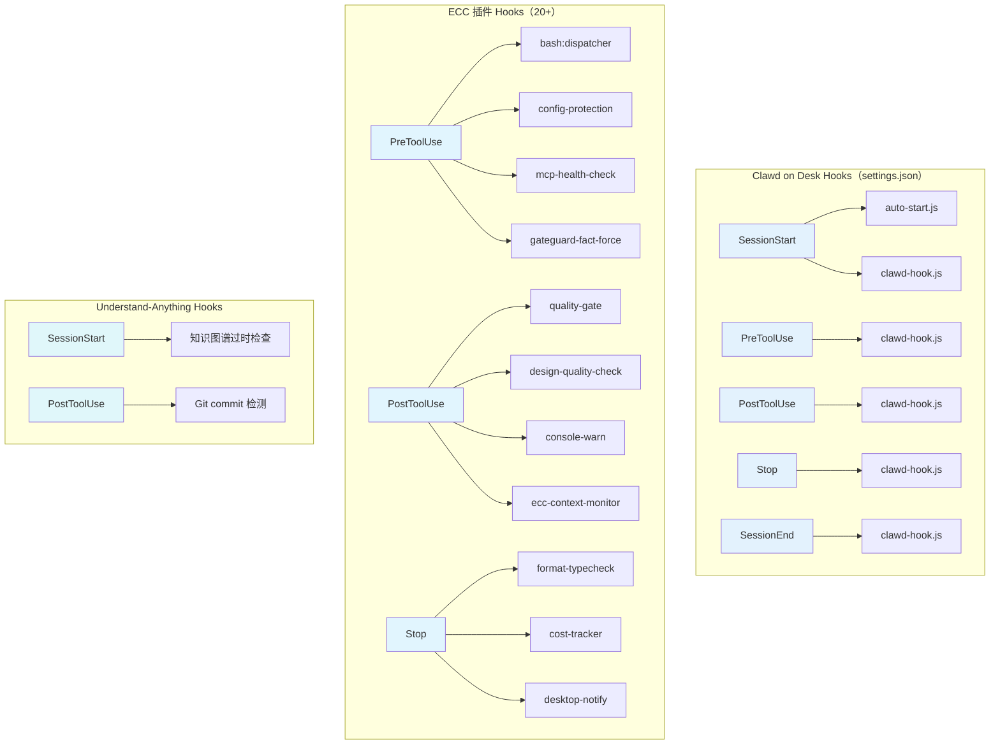
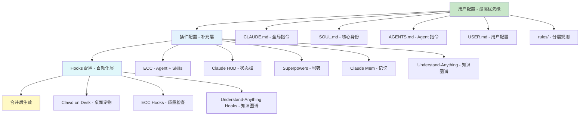
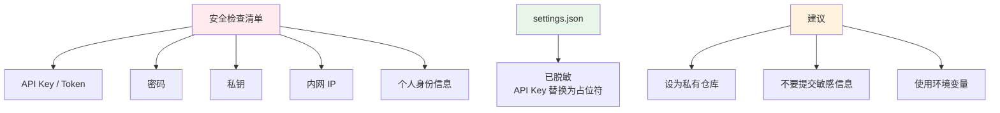

# Shuai Yemao Chip

Claude Code 完整配置备份 — 用于在新电脑上快速恢复开发环境。

## 🏗️ 系统架构



## 📦 仓库关系



## 🚀 快速开始

### 一键安装

```bash
# 克隆配置仓库
git clone https://github.com/shuai-yemao/shuai-yemao-chip.git ~/shuai-yemao-chip

# 运行安装脚本
cd ~/shuai-yemao-chip
./scripts/install.sh

# 安装插件
./scripts/install-plugins.sh

# 安装 Understand-Anything（知识图谱）
git clone https://github.com/Lum1104/Understand-Anything.git ~/.claude/plugins/marketplaces/Understand-Anything
cd ~/.claude/plugins/marketplaces/Understand-Anything
./install.sh claude

# 在 settings.json 中启用插件（12 个）
# "enabledPlugins": {
#   "ecc@ecc": true,
#   "claude-hud@claude-hud": true,
#   "superpowers@superpowers-marketplace": true,
#   "claude-code-zh-cn": true,
#   "claude-mem@thedotmack": true,
#   "understand-anything@understand-anything": true,
#   "codex@openai-codex": true,
#   "clangd-lsp@claude-plugins-official": true,
#   "pyright-lsp@claude-plugins-official": true,
#   "claude-md-management@claude-plugins-official": true,
#   "hookify@claude-plugins-official": true,
#   "skill-creator@claude-plugins-official": true,
#   "session-report@claude-plugins-official": true
# }

# 配置 API Key
vim ~/.claude/settings.json

# 重启 Claude Code
claude
```

### 安装流程



## 📁 仓库结构



## 🔌 插件系统（12 个）

```mermaid
graph TB
    subgraph "社区插件"
        A[ECC] --> A1[163 Agent]
        A --> A2[107 Skills]
        A --> A3[Commands]
        A --> A4[Hooks]

        B[Claude HUD] --> B1[状态栏]
        B --> B2[进度显示]
        B --> B3[成本追踪]

        C[Superpowers] --> C1[增强技能]
        C --> C2[社区工作流]

        D[Claude 中文] --> D1[界面汉化]
        D --> D2[中文提示]

        E[Claude Mem] --> E1[记忆持久化]
        E --> E2[上下文管理]

        F[Understand-Anything] --> F1[知识图谱]
        F --> F2[代码分析]

        G[Codex] --> G1[OpenAI 集成]
        G --> G2[协作编程]
    end

    subgraph "官方插件（Anthropic）"
        H[clangd-lsp] --> H1[C/C++ 代码智能]
        I[pyright-lsp] --> I1[Python 类型检查]
        J[claude-md-management] --> J1[CLAUDE.md 管理]
        K[hookify] --> K1[Hook 自动创建]
        L[skill-creator] --> L1[技能创建/评估]
        M[session-report] --> M1[会话报告生成]
    end

    subgraph "插件来源"
        N[GitHub 仓库]
        N --> O[affaan-m/ECC]
        N --> P[jarrodwatts/claude-hud]
        N --> Q[obra/superpowers-marketplace]
        N --> R[anthropics/claude-plugins-official]
        N --> S[thedotmack/claude-mem]
        N --> T[Lum1104/Understand-Anything]
        N --> U[openai/codex-plugin-cc]
    end

    O --> A
    P --> B
    Q --> C
    R --> D
    R --> H
    R --> I
    R --> J
    R --> K
    R --> L
    R --> M
    S --> E
    T --> F
    U --> G

    style A fill:#e1f5fe
    style B fill:#f3e5f5
    style C fill:#e8f5e9
    style D fill:#fff3e0
    style E fill:#fce4ec
    style F fill:#e0f7fa
    style G fill:#ede7f6
    style H fill:#ffebee
    style I fill:#ffebee
    style J fill:#ffebee
    style K fill:#ffebee
    style L fill:#ffebee
    style M fill:#ffebee
```



## 🔗 MCP 服务器



### MCP 配置

```json
{
  "mcpServers": {
    "dbhub": {
      "command": "pnpm",
      "args": ["dlx", "@bytebase/dbhub@latest", "--transport", "stdio"]
    }
  }
}
```

**DBHub MCP** - 数据库连接
- `execute_sql`: 执行 SQL 查询，支持事务和安全控制
- `search_objects`: 搜索和探索数据库结构
- 支持 SQLite, PostgreSQL, MySQL, SQL Server, MariaDB

## 🔧 Hooks 系统



### Clawd on Desk 功能

| 功能 | 说明 |
|------|------|
| **实时状态感知** | 通过 Claude Code hooks 实时显示工作状态 |
| **12 种动画状态** | idle, thinking, typing, building, error, happy 等 |
| **权限气泡** | Claude Code 请求权限时弹出气泡提醒 |
| **拖拽移动** | 可以拖拽到屏幕任意位置 |
| **迷你模式** | 拖到屏幕边缘隐藏，鼠标悬停显示 |
| **免打扰模式** | 右键菜单进入睡眠模式 |
| **多代理支持** | Claude Code, Codex, Copilot, Gemini 等 |
| **系统托盘** | 调整大小、语言切换、自动启动 |

### 安装方式

```bash
# 下载安装包
# 访问: https://github.com/rullerzhou-afk/clawd-on-desk/releases/latest
# 下载: Clawd-on-Desk-Setup-*-x64.exe

# 或从源码安装
git clone https://github.com/rullerzhou-afk/clawd-on-desk.git
cd clawd-on-desk
npm install
npm start
```

## 🎯 核心配置说明

### 配置层级



### CLAUDE.md - 全局指令

提供 Claude Code 的项目级指导，包括：

| 内容 | 说明 |
|------|------|
| **项目概述** | Claude Code 插件 — 生产级 Agent、Skills、Hooks、Commands |
| **安全防护基线** | 防止角色覆盖、数据泄露、恶意内容生成 |
| **架构说明** | agents/、skills/、commands/、hooks/、rules/ 目录结构 |
| **关键命令** | `/tdd`、`/plan`、`/e2e`、`/code-review`、`/build-fix` |
| **开发规范** | 包管理器检测、跨平台支持、Agent/Skill 格式 |

### SOUL.md - 核心身份

ECC 的核心身份和原则：

| 原则 | 说明 |
|------|------|
| **Agent-First** | 尽早路由到专业 Agent 处理领域任务 |
| **Test-Driven** | 先写测试再实现，要求 80%+ 覆盖率 |
| **Security-First** | 验证所有输入，保护密钥，保持安全默认值 |
| **Immutability** | 优先不可变操作，避免状态突变 |
| **Plan Before Execute** | 复杂变更分阶段规划 |

**Agent 编排哲学**：专业 Agent 被主动调用 — planner 用于实现策略，reviewer 用于代码质量，security-reviewer 用于敏感代码，build-resolver 用于工具链故障。

### AGENTS.md - Agent 指令

ECC v2.1.0 提供 **163 个专业 Agent**：

| Agent 类别 | 代表 Agent | 用途 |
|------------|-----------|------|
| **规划** | planner、architect | 实现规划、系统设计 |
| **开发** | tdd-guide、code-reviewer | 测试驱动开发、代码审查 |
| **安全** | security-reviewer | 漏洞检测 |
| **构建** | build-error-resolver | 修复构建/类型错误 |
| **测试** | e2e-runner | 端到端 Playwright 测试 |
| **语言专属** | cpp-reviewer、go-reviewer、rust-reviewer、python-reviewer 等 | 各语言代码审查 |
| **运维** | loop-operator、harness-optimizer | 自动循环执行、配置调优 |

**Agent 编排规则**：

| 场景 | 自动调用 Agent |
|------|---------------|
| 复杂功能请求 | **planner** |
| 代码刚写/修改 | **code-reviewer** |
| Bug 修复或新功能 | **tdd-guide** |
| 架构决策 | **architect** |
| 安全敏感代码 | **security-reviewer** |
| 棕地项目接入 | **spec-miner** |

**安全指南**：提交前检查清单（无硬编码密钥、输入验证、SQL 注入防护、XSS 防护等）

**编码风格**：不可变性优先、小文件（200-400 行）、错误处理、输入验证

**测试要求**：最低 80% 覆盖率，强制 TDD 工作流（RED → GREEN → REFACTOR）

**开发工作流**：Plan → TDD → Review → Capture Knowledge → Commit

## 🔒 安全说明



⚠️ **重要安全提示**

1. **settings.json 已脱敏** - API Key 等敏感信息已替换为占位符
2. **不要提交敏感信息** - `.env.secrets`、API Key 等不要上传到公开仓库
3. **私有仓库建议** - 建议将此仓库设为私有

## 📚 相关文档

| 文档 | 说明 |
|------|------|
| [INSTALL.md](INSTALL.md) | 完整安装指南 |
| [PLUGINS.md](PLUGINS.md) | 插件安装指南（含 GitHub 链接） |
| [CONFIG-ARCHITECTURE.md](CONFIG-ARCHITECTURE.md) | 配置架构详解 |

## 📦 相关仓库

| 仓库 | 内容 | 地址 |
|------|------|------|
| **shuai-yemao-chip** | 核心配置 | https://github.com/shuai-yemao/shuai-yemao-chip |
| **shuai-yemao-chip-skills** | 技能包（142） | https://github.com/shuai-yemao/shuai-yemao-chip-skills |
| **shuai-yemao-workflow** | 工作流（15+） | https://github.com/shuai-yemao/shuai-yemao-workflow |

## 📋 更新日志

### 2026-06-30

- ✅ 新增 6 个官方插件（global 作用域）
  - **clangd-lsp** — C/C++ 代码智能提示、跳转、诊断
  - **pyright-lsp** — Python 类型检查和代码智能
  - **claude-md-management** — CLAUDE.md 审查和会话学习捕获
  - **hookify** — Hook 自动化创建（分析会话预防不良行为）
  - **skill-creator** — 技能创建、优化和评估
  - **session-report** — HTML 会话报告（令牌/缓存/子代理）
- ✅ 新增 Codex 插件（OpenAI 协作编程）
- ✅ 新增 claude-plugins-official 市场源配置
- ✅ 更新 plugin-registry.json 注册表
- ✅ 同步 settings.json（hooks/statusline/spinner/language）
- ✅ 插件总数：6 → 12，Agent 总数：79 → 163，Skills：107+

### 2026-06-25

- ✅ 更新 Agent 数量：163（含官方插件新增）
- ✅ 同步所有 Agent 定义文件到仓库
- ✅ 更新配置文件（AGENTS.md / SOUL.md / CLAUDE.md / USER.md）
- ✅ 启用 Understand-Anything 插件（知识图谱）
  - 添加到 enabledPlugins
  - 配置 SessionStart 和 PostToolUse hooks
- ✅ 启用 ECC 插件（20+ hooks 已加载）
  - PreToolUse: bash:dispatcher, config-protection, mcp-health-check, gateguard-fact-force
  - PostToolUse: quality-gate, design-quality-check, console-warn, ecc-context-monitor
  - Stop: format-typecheck, cost-tracker, desktop-notify
- ✅ 更新插件系统图（12 个插件）
- ✅ 更新 MCP 服务器配置（仅 DBHub）
- ✅ 新增 Hooks 系统图（Clawd on Desk + ECC + Understand-Anything）
- ✅ 移除 Context7 MCP（未配置）

### 2026-06-24

- ✅ 初始版本
- ✅ 核心配置采用 ECC 标准（CLAUDE.md / SOUL.md / AGENTS.md / USER.md）
- ✅ 规则体系（security / workflow / embedded / privacy / ecc）
- ✅ 参考文档（EMBEDDED.md / SECURITY.md / WORKFLOWS.md）
- ✅ 插件配置（ECC / HUD / Superpowers / 中文 / Mem / Understand-Anything）
- ✅ 安装脚本（install.sh / install-plugins.sh）
- ✅ 完整文档（README / INSTALL / PLUGINS / CONFIG-ARCHITECTURE）
- ✅ README 使用 Mermaid 图表可视化架构
- ✅ 添加 Understand-Anything 知识图谱插件
- ✅ 更新技能包数量：142 个技能

## 📄 许可证

MIT License
