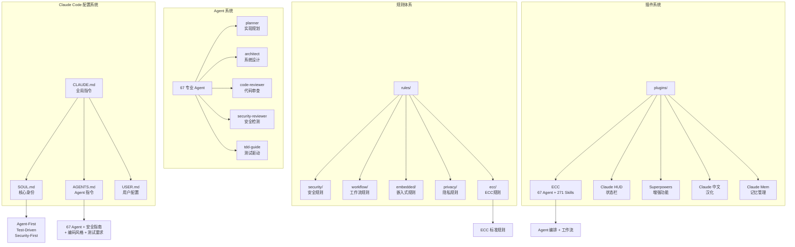
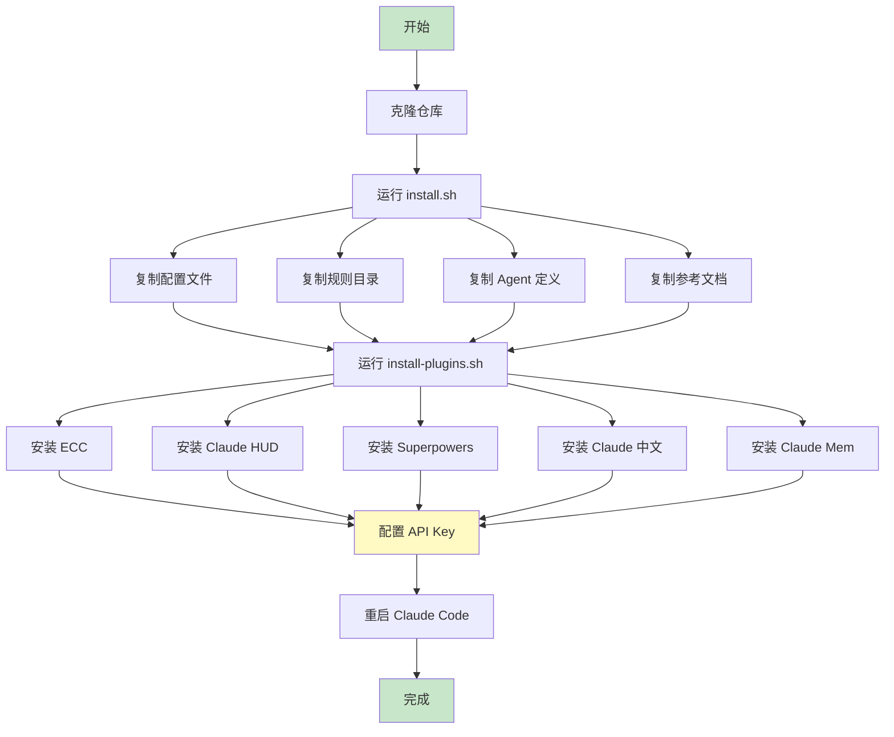
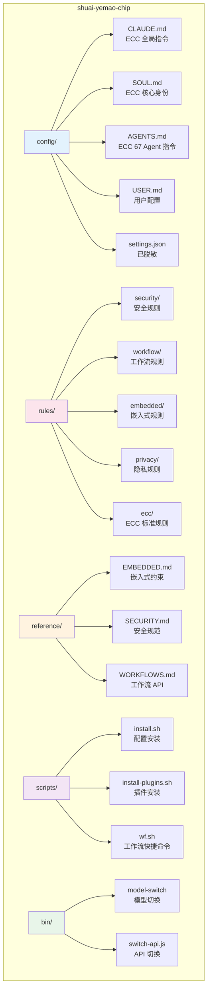
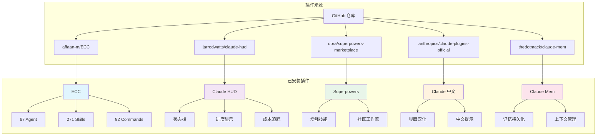
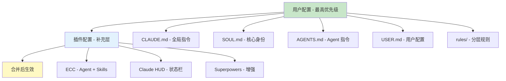
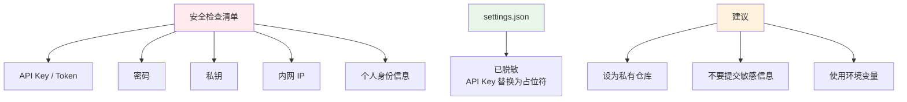

# Shuai Yemao Chip

Claude Code 完整配置备份 — 用于在新电脑上快速恢复开发环境。

## 🏗️ 系统架构



## 📦 仓库关系


## 🚀 快速开始

### 一键安装

```bash
# 克隆配置仓库
git clone https://github.com/shuai-yemao/shuai-yemao-chip.git ~/shuai-yemao-chip

# 运行安装脚本
cd ~/shuai-yemao-chip
./scripts/install.sh

# 安装插件
./scripts/install-plugins.sh

# 配置 API Key
vim ~/.claude/settings.json

# 重启 Claude Code
claude
```

### 安装流程



## 📁 仓库结构



## 🔌 插件系统



## 🎯 核心配置说明

### 配置层级



### CLAUDE.md - 全局指令

提供 Claude Code 的项目级指导，包括：

| 内容 | 说明 |
|------|------|
| **项目概述** | Claude Code 插件 — 生产级 Agent、Skills、Hooks、Commands |
| **安全防护基线** | 防止角色覆盖、数据泄露、恶意内容生成 |
| **架构说明** | agents/、skills/、commands/、hooks/、rules/ 目录结构 |
| **关键命令** | `/tdd`、`/plan`、`/e2e`、`/code-review`、`/build-fix` |
| **开发规范** | 包管理器检测、跨平台支持、Agent/Skill 格式 |

### SOUL.md - 核心身份

ECC 的核心身份和原则：

| 原则 | 说明 |
|------|------|
| **Agent-First** | 尽早路由到专业 Agent 处理领域任务 |
| **Test-Driven** | 先写测试再实现，要求 80%+ 覆盖率 |
| **Security-First** | 验证所有输入，保护密钥，保持安全默认值 |
| **Immutability** | 优先不可变操作，避免状态突变 |
| **Plan Before Execute** | 复杂变更分阶段规划 |

**Agent 编排哲学**：专业 Agent 被主动调用 — planner 用于实现策略，reviewer 用于代码质量，security-reviewer 用于敏感代码，build-resolver 用于工具链故障。

### AGENTS.md - Agent 指令

ECC v2.0.0 提供 **67 个专业 Agent**：

| Agent 类别 | 代表 Agent | 用途 |
|------------|-----------|------|
| **规划** | planner、architect | 实现规划、系统设计 |
| **开发** | tdd-guide、code-reviewer | 测试驱动开发、代码审查 |
| **安全** | security-reviewer | 漏洞检测 |
| **构建** | build-error-resolver | 修复构建/类型错误 |
| **测试** | e2e-runner | 端到端 Playwright 测试 |
| **语言专属** | cpp-reviewer、go-reviewer、rust-reviewer、python-reviewer 等 | 各语言代码审查 |
| **运维** | loop-operator、harness-optimizer | 自动循环执行、配置调优 |

**Agent 编排规则**：

| 场景 | 自动调用 Agent |
|------|---------------|
| 复杂功能请求 | **planner** |
| 代码刚写/修改 | **code-reviewer** |
| Bug 修复或新功能 | **tdd-guide** |
| 架构决策 | **architect** |
| 安全敏感代码 | **security-reviewer** |
| 棕地项目接入 | **spec-miner** |

**安全指南**：提交前检查清单（无硬编码密钥、输入验证、SQL 注入防护、XSS 防护等）

**编码风格**：不可变性优先、小文件（200-400 行）、错误处理、输入验证

**测试要求**：最低 80% 覆盖率，强制 TDD 工作流（RED → GREEN → REFACTOR）

**开发工作流**：Plan → TDD → Review → Capture Knowledge → Commit

## 🔒 安全说明



⚠️ **重要安全提示**

1. **settings.json 已脱敏** - API Key 等敏感信息已替换为占位符
2. **不要提交敏感信息** - `.env.secrets`、API Key 等不要上传到公开仓库
3. **私有仓库建议** - 建议将此仓库设为私有

## 📚 相关文档

| 文档 | 说明 |
|------|------|
| [INSTALL.md](INSTALL.md) | 完整安装指南 |
| [PLUGINS.md](PLUGINS.md) | 插件安装指南（含 GitHub 链接） |
| [CONFIG-ARCHITECTURE.md](CONFIG-ARCHITECTURE.md) | 配置架构详解 |

## 📦 相关仓库

| 仓库 | 内容 | 地址 |
|------|------|------|
| **shuai-yemao-chip** | 核心配置 | https://github.com/shuai-yemao/shuai-yemao-chip |
| **shuai-yemao-chip-skills** | 技能包（85+） | https://github.com/shuai-yemao/shuai-yemao-chip-skills |
| **shuai-yemao-workflow** | 工作流（15+） | https://github.com/shuai-yemao/shuai-yemao-workflow |

## 📋 更新日志

### 2026-06-24

- ✅ 初始版本
- ✅ 核心配置采用 ECC 标准（CLAUDE.md / SOUL.md / AGENTS.md / USER.md）
- ✅ 规则体系（security / workflow / embedded / privacy / ecc）
- ✅ 参考文档（EMBEDDED.md / SECURITY.md / WORKFLOWS.md）
- ✅ 插件配置（ECC / HUD / Superpowers / 中文 / Mem）
- ✅ 安装脚本（install.sh / install-plugins.sh）
- ✅ 完整文档（README / INSTALL / PLUGINS / CONFIG-ARCHITECTURE）
- ✅ README 使用 Mermaid 图表可视化架构

## 📄 许可证

MIT License
