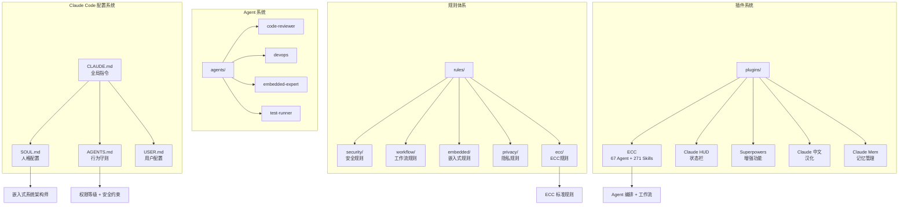
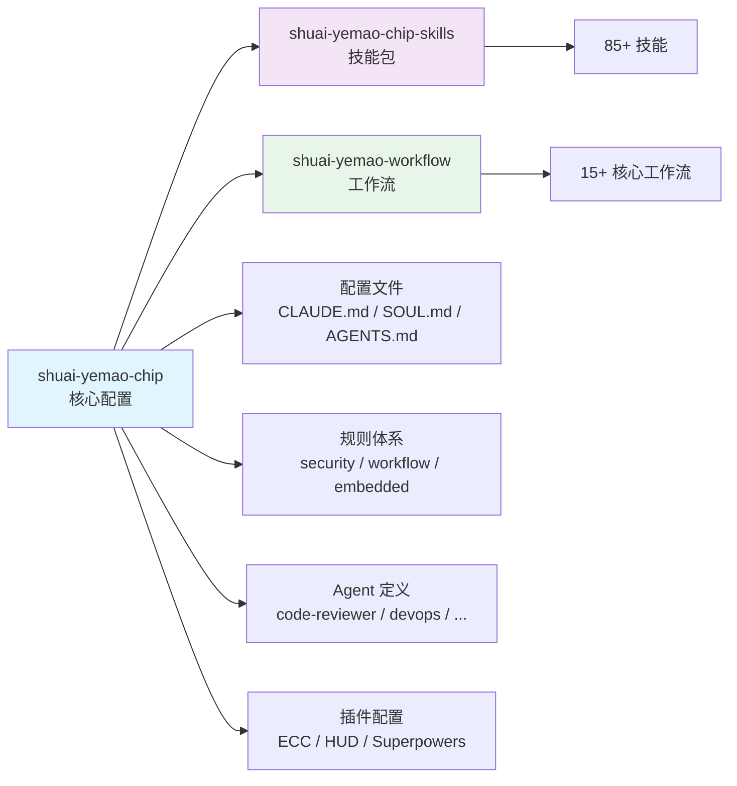
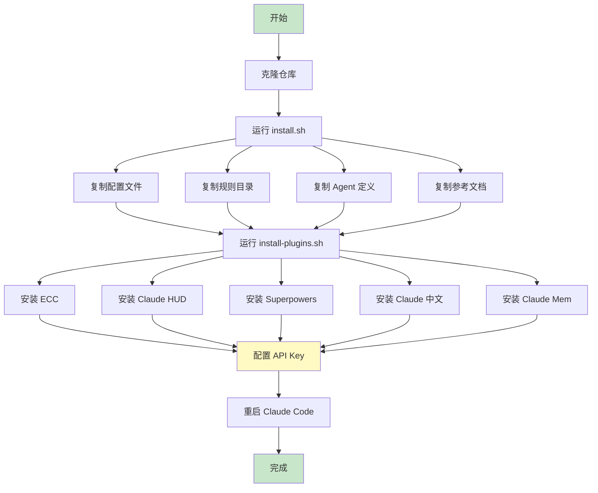
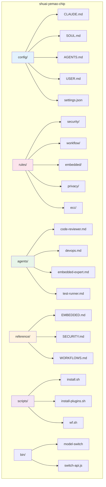
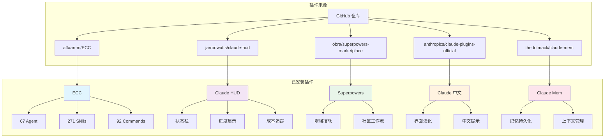
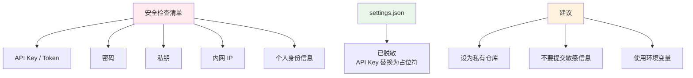

# Shuai Yemao Chip

Claude Code 完整配置备份 — 用于在新电脑上快速恢复开发环境。

## 🏗️ 系统架构



## 📦 仓库关系



## 🚀 快速开始

### 一键安装

```bash
# 克隆配置仓库
git clone https://github.com/shuai-yemao/shuai-yemao-chip.git ~/shuai-yemao-chip

# 运行安装脚本
cd ~/shuai-yemao-chip
./scripts/install.sh

# 安装插件
./scripts/install-plugins.sh

# 配置 API Key
vim ~/.claude/settings.json

# 重启 Claude Code
claude
```

### 安装流程



## 📁 仓库结构



## 🔌 插件系统



## 🎯 核心配置说明

### 配置层级


### SOUL.md - 人格配置

| 领域 | 覆盖方向 |
|------|----------|
| **MCU 架构** | ARM Cortex（core 寄存器、中断异常、内存架构）、STM32 HAL/SPL |
| **外设驱动** | ADC、DAC、DMA、Timer、Watchdog、CRC、RTC、Flash、SRAM |
| **总线协议** | I²C、SPI、CAN、UART、USB |
| **无线通信** | BLE、WiFi、LoRa、GPS、Cellular、MQTT |
| **RTOS** | FreeRTOS 模块、RTOS 调试与优化 |
| **工具链** | CMake、IAR、Keil、ESP-IDF、PlatformIO |

### AGENTS.md - 行为守则

| 权限等级 | 行为 |
|----------|------|
| 🟢 **自动** | 读、查、问（不需要确认） |
| 🟡 **确认** | 写、改、删、执行（先问再干） |
| 🔴 **必须批准** | 不可逆操作（git push、rm -rf 等） |

## 🔒 安全说明



⚠️ **重要安全提示**

1. **settings.json 已脱敏** - API Key 等敏感信息已替换为占位符
2. **不要提交敏感信息** - `.env.secrets`、API Key 等不要上传到公开仓库
3. **私有仓库建议** - 建议将此仓库设为私有

## 📚 相关文档

| 文档 | 说明 |
|------|------|
| [INSTALL.md](INSTALL.md) | 完整安装指南 |
| [PLUGINS.md](PLUGINS.md) | 插件安装指南（含 GitHub 链接） |
| [CONFIG-ARCHITECTURE.md](CONFIG-ARCHITECTURE.md) | 配置架构详解 |

## 📦 相关仓库

| 仓库 | 内容 | 地址 |
|------|------|------|
| **shuai-yemao-chip** | 核心配置 | https://github.com/shuai-yemao/shuai-yemao-chip |
| **shuai-yemao-chip-skills** | 技能包（85+） | https://github.com/shuai-yemao/shuai-yemao-chip-skills |
| **shuai-yemao-workflow** | 工作流（15+） | https://github.com/shuai-yemao/shuai-yemao-workflow |

## 📋 更新日志

### 2026-06-24

- ✅ 初始版本
- ✅ 核心配置（CLAUDE.md / SOUL.md / AGENTS.md / USER.md）
- ✅ 规则体系（security / workflow / embedded / privacy / ecc）
- ✅ Agent 定义（code-reviewer / devops / embedded-expert / test-runner）
- ✅ 参考文档（EMBEDDED.md / SECURITY.md / WORKFLOWS.md）
- ✅ 插件配置（ECC / HUD / Superpowers / 中文 / Mem）
- ✅ 安装脚本（install.sh / install-plugins.sh）
- ✅ 完整文档（README / INSTALL / PLUGINS / CONFIG-ARCHITECTURE）

## 📄 许可证

MIT License
