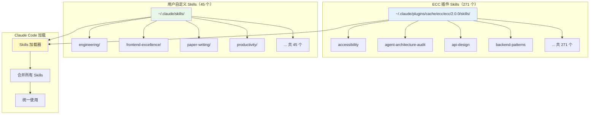
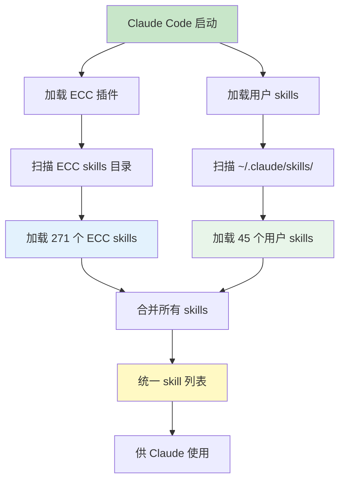
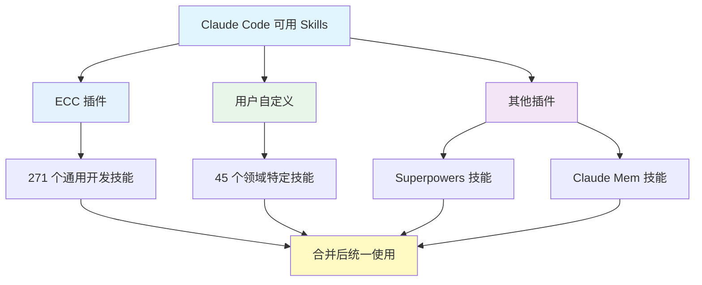

# Skills 架构说明

## ECC Skills vs 用户 Skills

**是的，它们是分开的！** ECC 的 skills 和用户的 skills 存放在不同目录，但会合并使用。

## 目录结构



## 详细对比

| 特性 | ECC Skills | 用户 Skills |
|------|-----------|-------------|
| **位置** | `~/.claude/plugins/cache/ecc/.../skills/` | `~/.claude/skills/` |
| **数量** | 271 个 | 45 个 |
| **来源** | ECC 插件自带 | 用户手动安装/创建 |
| **更新** | 随 ECC 插件更新 | 用户自行管理 |
| **内容** | 通用开发技能 | 领域特定技能 |

## 两者的 Skills 示例

### ECC Skills（通用开发）

| Skill | 用途 |
|-------|------|
| `api-design` | API 设计最佳实践 |
| `backend-patterns` | 后端架构模式 |
| `frontend-patterns` | 前端架构模式 |
| `testing-strategies` | 测试策略 |
| `security-audit` | 安全审计 |
| `performance-optimization` | 性能优化 |

### 用户 Skills（领域特定）

| Skill | 用途 |
|-------|------|
| `engineering/` | 工程开发（TDD、代码审查等） |
| `frontend-excellence/` | 前端开发最佳实践 |
| `paper-writing/` | 论文写作辅助 |
| `productivity/` | 生产力工具（grill-me、teach 等） |
| `knowledge-base-search/` | 知识库搜索 |
| `embedded/` | 嵌入式开发（如果添加） |

## 配置说明

### settings.json 中的 skills 配置

```json
{
  "skills": {
    "directories": [
      "C:/Users/zhang/.claude/skills",
      "C:\\Users\\zhang\\.claude\\skills"
    ]
  }
}
```

**注意**：这个配置只指定了用户自定义 skills 的目录。ECC 的 skills 通过插件系统自动加载。

## Skills 加载流程



## 实际使用示例

### 场景 1：使用 ECC 的 skill

```bash
# 用户说："帮我设计一个 API"
# Claude 自动使用 ECC 的 api-design skill
# 位置：~/.claude/plugins/cache/ecc/.../skills/api-design/
```

### 场景 2：使用用户的 skill

```bash
# 用户说："帮我写论文"
# Claude 自动使用用户的 paper-writing skill
# 位置：~/.claude/skills/paper-writing/
```

### 场景 3：两者都使用

```bash
# 用户说："帮我实现一个功能"
# Claude 可能同时使用：
# - ECC 的 tdd-guide skill（测试驱动开发）
# - 用户的 engineering/tdd skill（TDD 最佳实践）
# - 两者互补，提供更全面的指导
```

## 如何添加自己的 Skill

### 方法 1：在用户目录创建

```bash
# 创建 skill 目录
mkdir -p ~/.claude/skills/my-custom-skill

# 创建 SKILL.md 文件
cat > ~/.claude/skills/my-custom-skill/SKILL.md << 'EOF'
---
name: my-custom-skill
description: 我的自定义技能
---

# My Custom Skill

## When to Use
- 当用户需要...

## How It Works
1. 步骤 1
2. 步骤 2

## Examples
- 示例 1
- 示例 2
EOF
```

### 方法 2：在项目目录创建

```bash
# 在项目根目录创建 .claude/skills/
mkdir -p .claude/skills/project-skill

# 创建 SKILL.md
cat > .claude/skills/project-skill/SKILL.md << 'EOF'
---
name: project-skill
description: 项目专属技能
---

# Project Skill
EOF
```

## Skills 来源汇总



## 总结

| 问题 | 答案 |
|------|------|
| ECC skills 和用户 skills 放一起吗？ | **不放一起**，分目录存放 |
| 会合并使用吗？ | **会合并**，Claude Code 统一加载 |
| 如何区分？ | ECC 在插件目录，用户在 `~/.claude/skills/` |
| 如何添加自己的？ | 在 `~/.claude/skills/` 创建目录和 SKILL.md |
| 会冲突吗？ | **不会冲突**，同名 skill 用户优先 |
